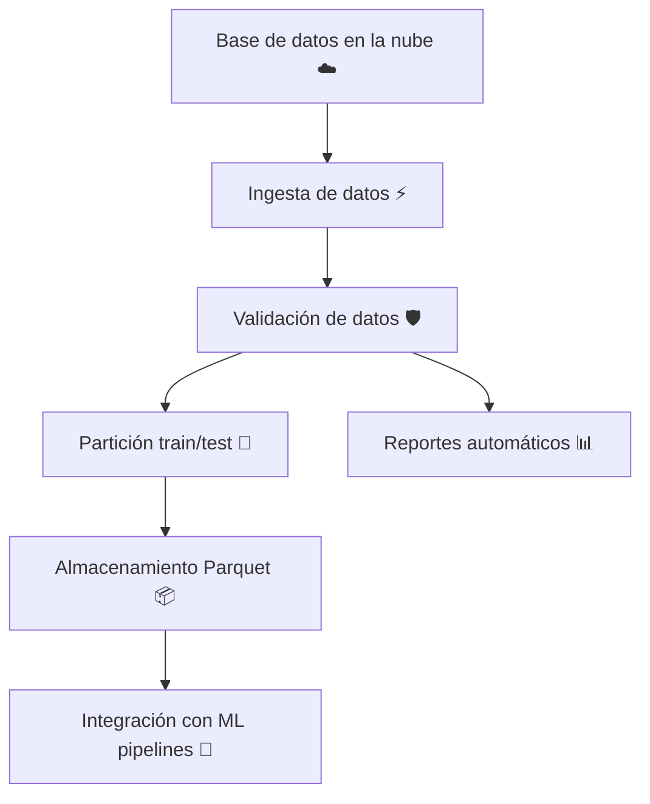

# Introducción 🚀

`feast-aws-deepchecks` es un proyecto diseñado para facilitar la gestión, validación y preprocesamiento de datos en flujos de machine learning. Su propósito es automatizar la carga, validación y partición de datos provenientes de bases de datos en la nube, asegurando su calidad antes de ser utilizados en modelos predictivos.

## Objetivos principales 🎯
- ⚡ Automatizar la ingesta de datos desde fuentes externas (por ejemplo, bases de datos en AWS).
- 🛡️ Validar la integridad y calidad de los datos mediante pruebas y reportes automáticos.
- 🔀 Dividir los datos en conjuntos de entrenamiento y prueba de forma reproducible.
- 🧩 Proveer una base sólida para la integración con pipelines de machine learning y monitoreo de datos.

## Mapa mental del proyecto 🗺️

